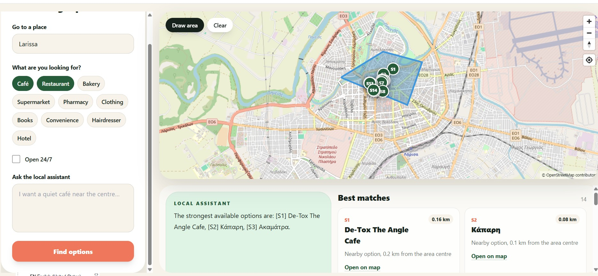

# Agora Scout

Agora Scout is a map-first shop discovery application for Greece. A user selects a real geographic area, chooses shop categories or asks a question in Greek or English, and receives ranked OpenStreetMap places with an explanation from an optional, free local AI model.

The normal search path uses no paid API, no cloud AI key, and no recurring third-party service. If local AI is unavailable, the application still returns the ranked shops with a deterministic summary.

## Application preview



_Example search in Larissa: the selected categories restrict the candidates, every result is located inside the drawn polygon, and assistant references such as `[S1]` match the map markers and result cards._

## Current functionality

### User experience

- Interactive MapLibre map using OpenStreetMap raster tiles with permanent attribution.
- Pan, zoom, browser geolocation, and Greek/English settlement autocomplete.
- Explicit polygon drawing: drawing begins only after selecting **Draw area / Σχεδίαση περιοχής**.
- Clear and redraw controls. A polygon needs at least three points and is completed by selecting the first point or pressing Enter.
- Server-side rejection of malformed, self-intersecting, out-of-Greece, or oversized polygons. The default limit is 250 km².
- Greek and English interface and assistant questions.
- Bilingual category filters for cafés, restaurants, bakeries, supermarkets, pharmacies, clothing, books, convenience stores, hairdressers, and hotels.
- A conservative **Open 24/7** filter.
- Search using either:
  - a written question;
  - one or more selected categories;
  - the Open 24/7 filter;
  - or a combination of these choices.
- Up to 20 result cards synchronized with numbered map markers (`S1`, `S2`, and so on).
- Selecting a result card highlights its marker; selecting a marker selects the matching card.
- Streaming assistant output with loading and error states.
- A new search clears the previous result state and cancels its request. Late events from an older stream cannot overwrite the current search.
- Responsive layout and keyboard-accessible controls/list navigation.

### Search and local AI

- PostGIS `ST_Intersects` filtering guarantees that returned shops are inside the selected polygon.
- User-selected categories are enforced before ranking. When no category is selected, common Greek and English category terms are inferred from the question.
- Candidates are ranked by `55% semantic similarity + 25% text similarity + 20% proximity`.
- Low-relevance candidates are removed instead of being returned only because they are nearby.
- Multilingual semantic embeddings use the local Ollama model `qwen3-embedding:0.6b`.
- Conversational answers use the local, quantized `qwen3:1.7b` model through Ollama.
- Only the best eight retrieved shop records are sent to the assistant.
- The assistant has no filesystem, network, SQL, or arbitrary tool access.
- Every AI-recommended shop must cite one of the supplied references such as `[S1]`. Invalid or invented references cause a deterministic fallback response.
- Only one model generation is accepted at a time. Ollama connection and response timeouts are bounded.
- If embeddings are unavailable, search falls back to category, trigram text, and proximity ranking.
- If answer generation is unavailable, times out, or is already busy, useful shop cards and a deterministic cited summary are still returned.

### Data and backend

- Django 5.2 on Python 3.12, served through ASGI/Uvicorn.
- PostgreSQL with PostGIS, pgvector, trigram indexes, spatial indexes, and an HNSW vector index.
- Free Greek shop, POI, and settlement data imported from a Geofabrik OpenStreetMap extract.
- Idempotent imports based on stable OSM type/ID, so rerunning an import updates records instead of duplicating them.
- Imported names, bilingual names, category, address, phone, website, opening hours, coordinates, and source timestamp where present.
- Separate local override storage for future owner/staff-managed fields.
- Valkey for the open-source cache/broker layer and a single-concurrency Celery worker.
- Recommendation rate limit of 30 requests per minute per anonymous client. Metadata endpoints are not charged against this limit.
- Structured validation errors, logging, health checks, JSON responses, and Server-Sent Events (SSE).
- Public responses do not expose embeddings, prompts, or internal ranking values.
- Database backup and restore scripts for local development.

## How to use the application

1. Open <http://localhost:5173> after completing the local setup below.
2. Use **Go to a place / Πήγαινε σε περιοχή** to find a Greek settlement. Select a suggestion to move the map there. This does not choose the search boundary by itself.
3. Select **Draw area / Σχεδίαση περιοχής** on the map.
4. Select at least three map points around the area you want to search. Select the first point again, or press Enter, to finish the polygon.
5. Optionally select one or more shop categories and/or **Open 24/7**.
6. Optionally type a question, for example:

   - `Θέλω ένα καφέ κοντά στο κέντρο`
   - `Πού υπάρχει φαρμακείο;`
   - `Find a bakery in this area`
   - `I want a restaurant near the centre`

7. Select **Find options / Βρες επιλογές**. The button is enabled once a polygon exists and there is either a question or an active filter.
8. Read the assistant summary and result cards. References in the answer correspond directly to the numbered map markers.
9. Select a card or marker to connect the list result to its map position.
10. For a different area, select **Clear / Καθαρισμός**, or select **Draw area** again to replace the polygon.

Important: OpenStreetMap fields vary by shop. The assistant is instructed not to invent Wi-Fi, quietness, accessibility, opening hours, or other details that are absent from the imported records.

## Quick start with demo data

Requirements:

- Docker Desktop with Docker Compose
- At least 10 GB free disk space
- Internet access for the initial Docker images and map tiles
- Ollama is optional; under 16 GB RAM is sufficient for the selected small models, but downloads and embedding generation take additional time

From PowerShell in the repository root:

```powershell
Copy-Item .env.example .env
docker compose --profile core build
docker compose --profile core up -d
docker compose --profile core exec web python manage.py migrate
docker compose --profile core exec web python manage.py seed_demo_shops
```

Alternatively, run the setup script:

```powershell
./scripts/setup.ps1
```

Then open:

- Frontend: <http://localhost:5173>
- API: <http://localhost:8000/api/v1/health>

Draw a small polygon around central Athens, where the demo records are located. The `core` profile does not start Ollama, but search and deterministic summaries remain available.

## Enable the free local AI

Start the AI services and download both models explicitly:

```powershell
docker compose --profile ai up -d
docker compose exec ollama ollama pull qwen3:1.7b
docker compose exec ollama ollama pull qwen3-embedding:0.6b
docker compose exec web python manage.py reembed_shops
```

Model downloads require internet access once and require no API key. They are cached in the `ollamadata` Docker volume. Normal AI queries are then sent only to the local Ollama service.

Check the installed models and application readiness:

```powershell
docker compose exec ollama ollama list
Invoke-RestMethod http://localhost:8000/api/v1/health
```

`reembed_shops` embeds only shops that do not yet have an embedding. To regenerate all vectors after changing the embedding model:

```powershell
docker compose exec web python manage.py reembed_shops --force
```

If a model download fails with a registry or CloudFront `EOF`, rerun the same `ollama pull` or `docker compose pull ollama` command. Existing search continues to work without the models.

## Import real OpenStreetMap data for Greece

The full country import is intentionally never run during application startup. It is resource-intensive and must be requested explicitly.

```powershell
docker compose exec web python manage.py download_osm --output /app/data/greece-latest.osm.pbf
docker compose --profile import run --rm osm-import
```

If local AI is enabled, generate embeddings after the import:

```powershell
docker compose exec web python manage.py reembed_shops
```

The importer handles the supported shop/amenity areas and nodes plus settlement nodes. Run the download and import commands again to refresh the snapshot; stable OSM identities prevent duplicate records. Automated minutely replication and source-deletion detection are not implemented yet.

OpenStreetMap data is licensed under the ODbL. Keep attribution visible, document derived-database obligations, do not prefetch or bulk-download public map tiles, and follow the [OpenStreetMap tile usage policy](https://operations.osmfoundation.org/policies/tiles/).

## Docker Compose profiles

| Profile | Services | Use case |
| --- | --- | --- |
| `core` | PostGIS/pgvector, Valkey, Django, React | Normal low-memory development without AI |
| `ai` | Core services, Ollama, Celery worker | Complete local AI search |
| `import` | Core services, one-shot OSM importer | Resource-intensive PBF import |
| `full` | Application, AI worker, Ollama, NGINX | Production-like local stack at <http://localhost:8080> |

Useful commands:

```powershell
# Start or rebuild core development
docker compose --profile core up -d --build

# Start the complete production-like local stack
docker compose --profile full up -d --build

# Inspect status and logs
docker compose ps
docker compose logs -f web frontend
docker compose logs -f ollama worker

# Apply database migrations
docker compose exec web python manage.py migrate

# Stop containers while keeping data volumes
docker compose --profile core down
```

## Configuration

Copy `.env.example` to `.env` and adjust values when needed:

| Variable | Default | Purpose |
| --- | --- | --- |
| `DJANGO_SECRET_KEY` | development placeholder | Django signing key; replace outside private local use |
| `DJANGO_DEBUG` | `True` in example | Development error output |
| `POSTGRES_*` | local development values | Database connection |
| `VALKEY_URL` | local Valkey database 1 | Cache and throttling support |
| `EMBEDDINGS_ENABLED` | `True` | Enables local Ollama embedding requests |
| `EMBEDDING_MODEL` | `qwen3-embedding:0.6b` | Configurable local embedding model; must output 1024 dimensions |
| `OLLAMA_URL` | `http://localhost:11434` | Local Ollama endpoint |
| `OLLAMA_MODEL` | `qwen3:1.7b` | Configurable local answer model |
| `OLLAMA_TIMEOUT` | `90` | Local generation timeout in seconds |
| `MAX_SEARCH_AREA_KM2` | `250` | Maximum accepted polygon area |
| `PROBE_OPTIONAL_SERVICES` | `False` | Include Valkey/Ollama TCP readiness probes in health output |

Compose supplies container-specific hostnames to the services. Do not commit real secrets in `.env`.

## API

### Recommendations

`POST /api/v1/recommendations` returns normal JSON. Add `?stream=true` or send `Accept: text/event-stream` for SSE.

```json
{
  "question": "Θέλω ένα καφέ κοντά στο κέντρο",
  "language": "el",
  "area": {
    "type": "Polygon",
    "coordinates": [
      [
        [23.70, 37.95],
        [23.77, 37.95],
        [23.77, 38.01],
        [23.70, 38.01],
        [23.70, 37.95]
      ]
    ]
  },
  "filters": {
    "categories": ["cafe"],
    "open_now": false,
    "max_distance_km": 10
  }
}
```

The direct API requires a question between 2 and 500 characters. The frontend creates a neutral question automatically when the user searches only with filters. `max_distance_km` is supported by the API from 0.1 to 100 km but is not currently exposed as a frontend control.

Normal JSON response:

```json
{
  "answer": "Οι καλύτερες διαθέσιμες επιλογές είναι: [S1] Example Café.",
  "shops": [
    {
      "id": 1,
      "slug": "example-cafe",
      "name": "Example Café",
      "reference": "S1",
      "category": "cafe",
      "latitude": 37.98,
      "longitude": 23.72,
      "distance_km": 0.4,
      "match_reason": "Category match, 0.4 km from the area centre"
    }
  ],
  "count": 1
}
```

SSE event types:

- `metadata`: result count and language
- `shops`: the ranked shop array
- `answer_delta`: a streamed piece of assistant text
- `done`: successful end of stream
- `error`: structured generation failure

### Other endpoints

| Endpoint | Description |
| --- | --- |
| `GET /api/v1/categories` | Bilingual filter definitions |
| `GET /api/v1/locations?q=Athens` | Up to ten local settlement matches; query requires two characters |
| `GET /api/v1/shops/{slug}` | Published shop details |
| `GET /api/v1/health` | Database and optional Valkey/Ollama readiness |
| `GET /admin/` | Django administration interface |

## Testing and code quality

Run the backend suite and Django checks:

```powershell
docker compose exec web python manage.py test
docker compose exec web python manage.py check
```

Run frontend lint and the production build:

```powershell
docker compose exec frontend npm run lint
docker compose exec frontend npm run build
```

The tests cover polygon validation, geographic filtering, bilingual category intent, grounded assistant citations, fallback behavior, response privacy, health/metadata behavior, and recommendation throttling.

## Backup and restore

Create a timestamped SQL backup in `backups/`:

```powershell
./scripts/backup.ps1
```

Restore a selected backup into the current development database:

```powershell
./scripts/restore.ps1 -BackupFile backups/shopfinder-YYYYMMDD-HHMMSS.sql
```

To completely discard all local database, Valkey, Ollama-model, and frontend dependency volumes and start fresh, stop every profile and explicitly remove volumes:

```powershell
docker compose --profile full --profile import down --volumes
./scripts/setup.ps1
```

Warning: `down --volumes` permanently removes the local Compose data. Create a backup first if the records matter.

## Troubleshooting

### The Find options button is disabled

Finish a valid polygon first, then provide either a question, a category, or the Open 24/7 filter. Location autocomplete only moves the map; it does not define the polygon.

### No categories appear

Check that the Django service is running, select the UI retry action, and inspect:

```powershell
Invoke-RestMethod http://localhost:8000/api/v1/categories
docker compose logs --tail 100 web
```

### Search returns HTTP 429

The anonymous recommendation limit is 30 searches per minute per client. Wait for the one-minute window instead of repeatedly selecting the search button. Category, location, and health requests do not consume this allowance.

### Search returns no shops

- Confirm the polygon contains imported/demo shop coordinates.
- Temporarily remove the Open 24/7 filter; it currently accepts only records whose OSM opening-hours value is exactly `24/7`.
- Confirm real data has been imported, or seed the Athens demo data.
- Broaden the polygon while keeping it below 250 km².
- A feature such as “quiet” or “Wi-Fi” may not exist in the OSM record; the app prefers no claim over an invented recommendation.

### The assistant shows a short deterministic answer

The shop retrieval is still valid, but Ollama is unavailable, busy, timed out, missing a model, or returned citations outside the retrieved shop set. Check:

```powershell
docker compose ps ollama
docker compose exec ollama ollama list
docker compose logs --tail 100 ollama web
```

### The browser still shows old behavior

Restart the Vite container and force-refresh the page:

```powershell
docker compose restart frontend
```

Then use `Ctrl+F5` in the browser.

## Hosting and GitHub Pages

GitHub Pages can host only the compiled static React frontend. It cannot run Django, PostGIS, Valkey, Celery, Ollama, OSM imports, or protect a private local API. Therefore GitHub Pages alone cannot host the complete application.

It can be used as a public demo frontend through GitHub Actions only if:

1. the Django API and database are deployed separately on an internet-accessible HTTPS host;
2. `VITE_API_BASE_URL` is set to that public API URL during the Vite build;
3. Django `CORS_ALLOWED_ORIGINS`, `CSRF_TRUSTED_ORIGINS`, and `ALLOWED_HOSTS` include the deployed domains;
4. Vite's base path matches the GitHub repository Pages path.

The local Qwen setup is designed for a machine you control. A permanently public AI backend still needs a server with enough RAM/CPU, storage, HTTPS, monitoring, backups, and abuse controls. “Free and open source” models and software do not make public compute or hosting free.

Kubernetes is intentionally excluded. Docker Compose is the appropriate local runtime for the current single-machine architecture; Kubernetes should be reconsidered only when there is a concrete multi-machine, scaling, or production orchestration requirement.

## Known limitations and planned work

- `Open 24/7` is deliberately conservative; a complete OSM opening-hours parser is not yet implemented.
- Public OSM tiles provide no SLA and must be replaced or self-hosted if traffic becomes substantial.
- Settlement autocomplete uses locally imported OSM records, not a full Nominatim deployment.
- The UI currently preserves only the selected language in the URL, not the polygon, filters, or question.
- Owner registration, listing claims, photo/offer management, moderation workflows, and local analytics are phase-two work and are not currently available.
- Automated OSM incremental replication/deletion handling is not currently available.
- Authentication dependencies exist for future owner functionality, but the public discovery flow does not require an account.

## License and attribution

Application dependencies and local AI models retain their respective licenses. Verify model terms before any production distribution. OpenStreetMap data is © OpenStreetMap contributors and available under the [Open Database License](https://www.openstreetmap.org/copyright).
